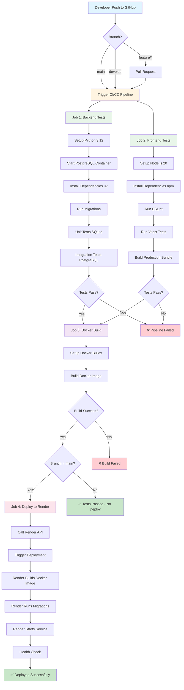
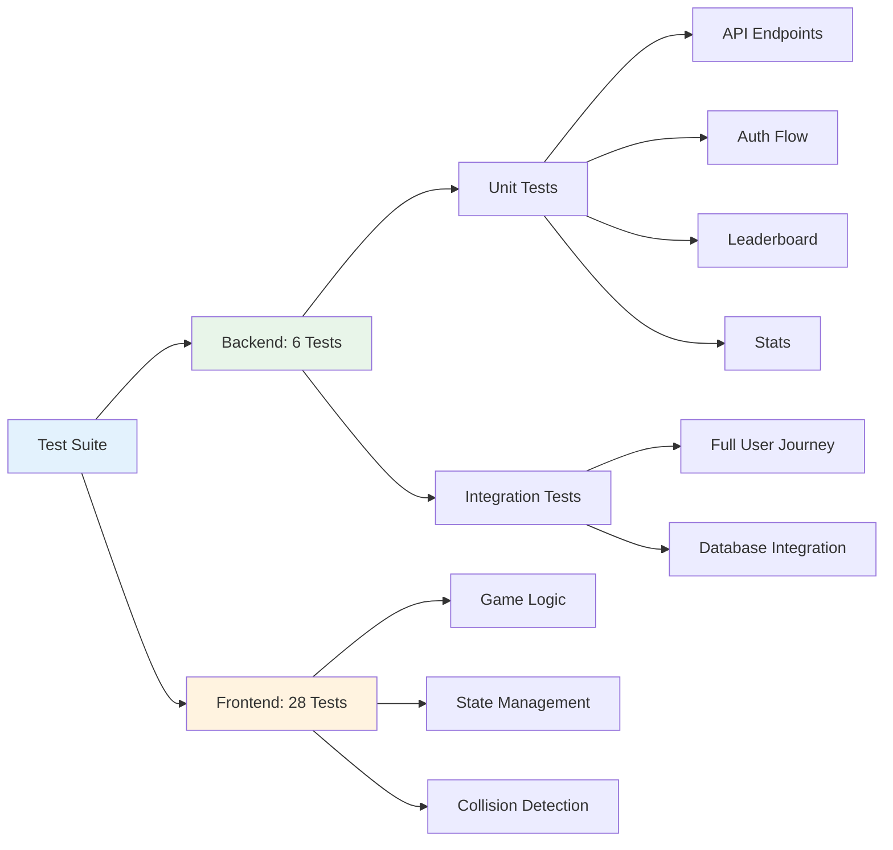
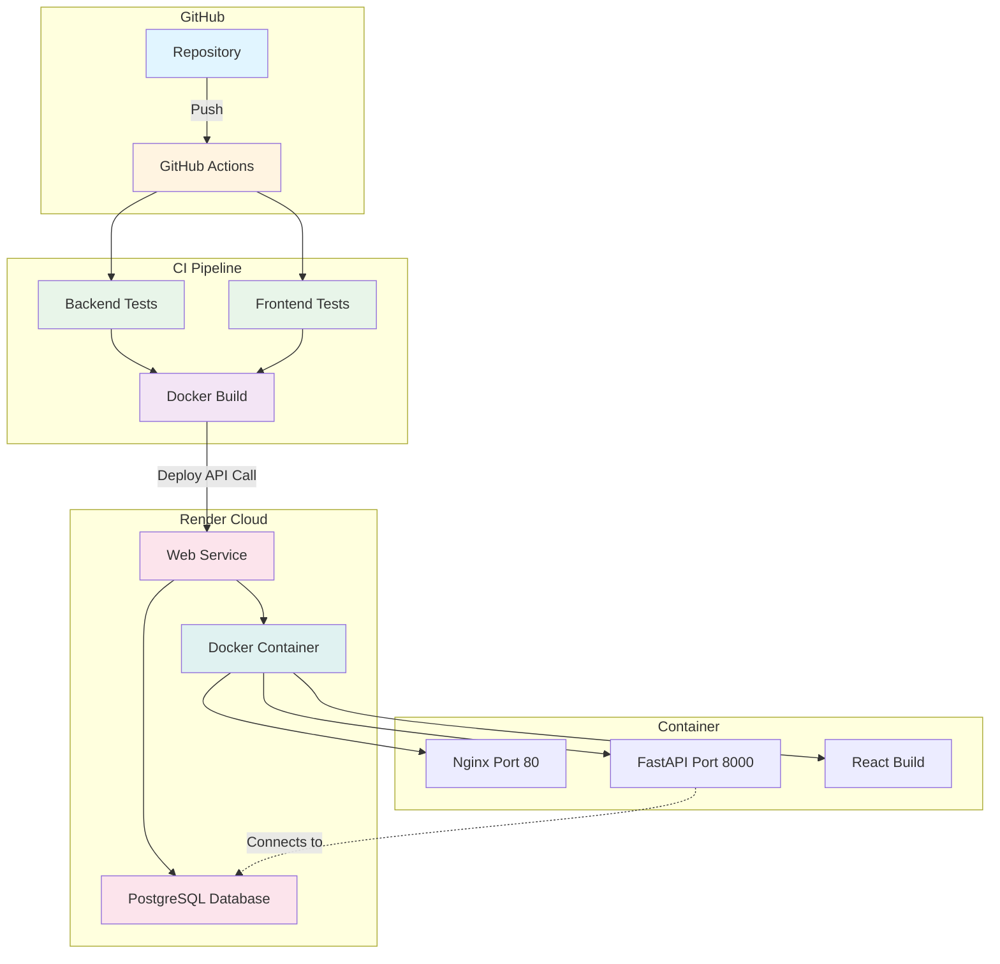
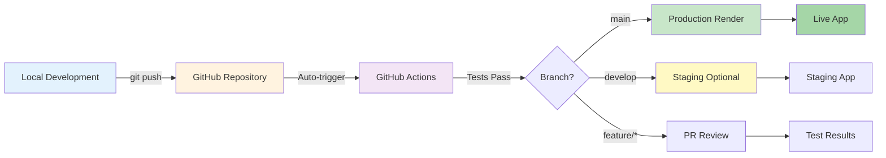
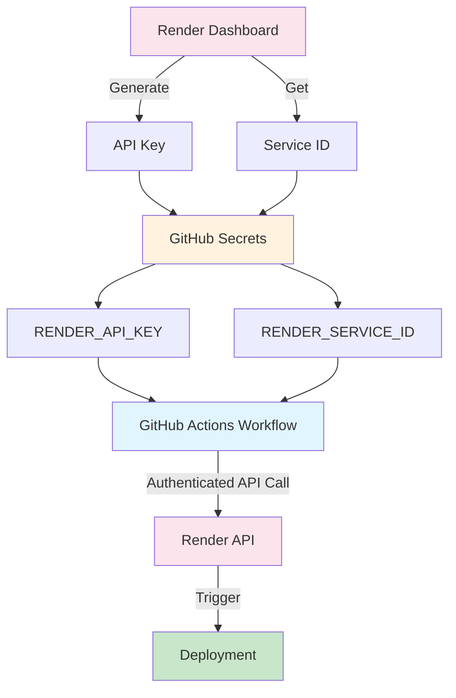
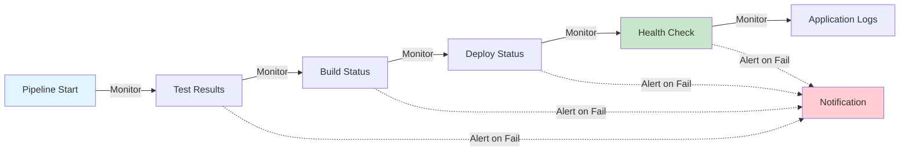

# CI/CD Architecture Overview

## Complete Pipeline Flow

## Test Coverage

## Deployment Architecture

## Environment Flow

## Security & Secrets Flow

## Timeline

```mermaid
gantt
    title CI/CD Pipeline Timeline
    dateFormat  ss
    axisFormat %S
    
    section Backend
    Setup Python       :00, 10s
    Install Deps       :10, 15s
    Unit Tests         :25, 5s
    Integration Tests  :30, 5s
    
    section Frontend
    Setup Node         :00, 10s
    Install Deps       :10, 20s
    Lint               :30, 3s
    Tests              :33, 3s
    Build              :36, 15s
    
    section Docker
    Build Image        :51, 60s
    
    section Deploy
    API Call           :111, 2s
    Render Build       :113, 180s
    Health Check       :293, 5s
```

**Total Pipeline Duration:** ~5-10 minutes

## Key Metrics

| Metric | Value |
|--------|-------|
| **Total Tests** | 34 (6 backend + 28 frontend) |
| **Test Duration** | ~1 second |
| **Build Duration** | ~5 minutes |
| **Deploy Duration** | ~3-5 minutes |
| **Total Pipeline** | ~8-10 minutes |
| **Success Rate** | Target: >95% |

## Monitoring Points

---

## Quick Stats

- **Languages:** Python, TypeScript, JavaScript
- **Frameworks:** FastAPI, React, Vite
- **Testing:** Pytest, Vitest
- **CI/CD:** GitHub Actions
- **Deployment:** Render
- **Database:** PostgreSQL
- **Container:** Docker
- **Web Server:** Nginx

---

**Last Updated:** 2025-12-17
