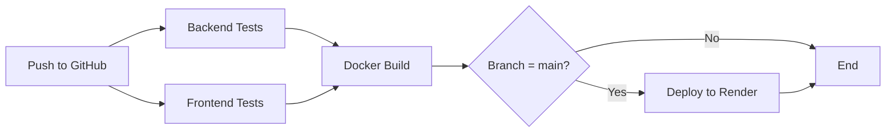

# GitHub Actions CI/CD Setup Guide

This guide explains how to set up the automated CI/CD pipeline for Snake Party.

## Overview

The CI/CD pipeline automatically:
1. ✅ Runs backend tests (unit + integration)
2. ✅ Runs frontend tests and linting
3. ✅ Validates Docker build
4. 🚀 Deploys to Render (only on `main` branch)

## Pipeline Workflow



---

## Setup Instructions

### Step 1: Get Render API Key

1. Go to [Render Dashboard](https://dashboard.render.com/)
2. Click on your **account avatar** (top right)
3. Select **Account Settings**
4. Navigate to **API Keys** section
5. Click **Create API Key**
6. Give it a name (e.g., "GitHub Actions")
7. **Copy the API key** (you won't see it again!)

### Step 2: Get Render Service ID

1. Go to your Render service (the web service you deployed)
2. Look at the URL in your browser:
   ```
   https://dashboard.render.com/web/srv-XXXXXXXXXXXXX
   ```
3. The Service ID is the part after `/web/`: `srv-XXXXXXXXXXXXX`

Alternatively, you can get it via API:
```bash
curl -H "Authorization: Bearer YOUR_API_KEY" \
  https://api.render.com/v1/services
```

### Step 3: Add GitHub Secrets

1. Go to your GitHub repository
2. Click **Settings** → **Secrets and variables** → **Actions**
3. Click **New repository secret**
4. Add these two secrets:

| Secret Name | Value | Description |
|-------------|-------|-------------|
| `RENDER_API_KEY` | Your Render API key from Step 1 | Authenticates with Render API |
| `RENDER_SERVICE_ID` | Your service ID from Step 2 | Identifies which service to deploy |

**Example:**
- `RENDER_API_KEY`: `rnd_abc123xyz789...`
- `RENDER_SERVICE_ID`: `srv-abc123xyz`

### Step 4: Push to GitHub

```bash
git add .
git commit -m "Add CI/CD pipeline"
git push origin main
```

The pipeline will automatically run!

---

## Pipeline Jobs

### 1. Backend Tests (`backend-tests`)

**What it does:**
- Sets up Python 3.12
- Installs dependencies with `uv`
- Runs database migrations
- Executes unit tests (SQLite)
- Executes integration tests (PostgreSQL)

**Environment:**
- PostgreSQL 15 service container
- Test database: `snakedb_test`

### 2. Frontend Tests (`frontend-tests`)

**What it does:**
- Sets up Node.js 20
- Installs dependencies with `npm ci`
- Runs ESLint linter
- Executes Vitest tests
- Builds production bundle
- Validates build output

### 3. Docker Build (`docker-build`)

**What it does:**
- Validates that the Docker image builds successfully
- Uses build cache for faster builds
- Runs only if tests pass

**Note:** This doesn't push the image; Render builds it separately.

### 4. Deploy (`deploy`)

**What it does:**
- Triggers deployment via Render API
- Only runs on `main` branch pushes
- Only runs if all tests pass

**Conditions:**
- ✅ All tests must pass
- ✅ Must be a push to `main` branch
- ❌ Skipped on pull requests
- ❌ Skipped on other branches

---

## Workflow Triggers

The pipeline runs on:

### Push Events
```yaml
branches:
  - main      # Runs tests + deployment
  - develop   # Runs tests only
```

### Pull Request Events
```yaml
branches:
  - main      # Runs tests only (no deployment)
  - develop   # Runs tests only
```

---

## Branch Strategy

### Recommended Workflow

1. **Feature Development**
   ```bash
   git checkout -b feature/my-feature
   # Make changes
   git push origin feature/my-feature
   ```
   - Create pull request to `develop`
   - CI runs tests (no deployment)

2. **Development Branch**
   ```bash
   git checkout develop
   git merge feature/my-feature
   git push origin develop
   ```
   - CI runs tests (no deployment)
   - Manual testing on staging

3. **Production Deployment**
   ```bash
   git checkout main
   git merge develop
   git push origin main
   ```
   - CI runs tests
   - ✅ **Automatically deploys to Render**

---

## Monitoring & Debugging

### View Pipeline Status

1. Go to your GitHub repository
2. Click **Actions** tab
3. See all workflow runs

### Check Logs

Click on any workflow run to see:
- Individual job logs
- Test results
- Deployment status

### Common Issues

#### ❌ Tests Failing

**Check:**
- Test logs in GitHub Actions
- Database connection issues
- Missing dependencies

**Fix:**
```bash
# Run tests locally first
cd backend
uv run pytest tests/ -v
uv run pytest tests_integration/ -v

cd ../frontend
npm run test
```

#### ❌ Deployment Failing

**Check:**
- `RENDER_API_KEY` is correct
- `RENDER_SERVICE_ID` is correct
- Render service is active

**Fix:**
- Verify secrets in GitHub Settings
- Check Render dashboard for errors
- Review Render deployment logs

#### ❌ Docker Build Failing

**Check:**
- Dockerfile syntax
- Missing files in context

**Fix:**
```bash
# Test Docker build locally
docker build -t snake-party:test .
```

---

## Pipeline Configuration

### Customize Triggers

Edit `.github/workflows/ci-cd.yml`:

```yaml
on:
  push:
    branches:
      - main
      - develop
      - staging  # Add more branches
```

### Skip CI

Add to commit message:
```bash
git commit -m "Update README [skip ci]"
```

### Manual Deployment

Trigger manually from GitHub Actions UI:
1. Go to **Actions** tab
2. Select **CI/CD Pipeline**
3. Click **Run workflow**

---

## Environment Variables

The pipeline uses these environment variables:

| Variable | Value | Used By |
|----------|-------|---------|
| `PYTHON_VERSION` | `3.12` | Backend tests |
| `NODE_VERSION` | `20` | Frontend tests |
| `DATABASE_URL` | Auto-configured | Backend tests |
| `RENDER_API_KEY` | Secret | Deployment |
| `RENDER_SERVICE_ID` | Secret | Deployment |

---

## Security Best Practices

✅ **DO:**
- Store API keys in GitHub Secrets
- Use least-privilege API keys
- Rotate API keys periodically
- Review deployment logs

❌ **DON'T:**
- Commit API keys to code
- Share secrets publicly
- Use personal access tokens in CI

---

## Advanced: Deploy Hooks

Render also supports **Deploy Hooks** (simpler alternative):

### Option 1: Deploy Hook (Simpler)

1. In Render Dashboard → Your Service → Settings
2. Scroll to **Deploy Hook**
3. Copy the webhook URL
4. Add to GitHub Secrets as `RENDER_DEPLOY_HOOK`
5. Update workflow:

```yaml
- name: Deploy to Render
  run: |
    curl -X POST "${{ secrets.RENDER_DEPLOY_HOOK }}"
```

### Option 2: API Key (Current - More Control)

- Allows checking deployment status
- Can deploy specific commits
- Better for complex workflows

---

## Cost Considerations

### GitHub Actions (Free Tier)
- 2,000 minutes/month for private repos
- Unlimited for public repos
- This pipeline uses ~5-10 minutes per run

### Render
- Deployments are free (included in plan)
- Build time counts toward your plan limits

---

## Next Steps

1. ✅ Set up GitHub Secrets
2. ✅ Push code to trigger pipeline
3. 🎯 Add more tests
4. 🎯 Set up staging environment
5. 🎯 Add deployment notifications (Slack, Discord)
6. 🎯 Implement blue-green deployments

---

## Troubleshooting Commands

### Test Locally Before Pushing

```bash
# Backend tests
cd backend
uv run pytest tests/ tests_integration/ -v

# Frontend tests
cd frontend
npm run lint
npm run test -- --run
npm run build

# Docker build
docker build -t snake-party:test .
```

### Check GitHub Actions Logs

```bash
# Install GitHub CLI
gh run list
gh run view <run-id>
gh run view <run-id> --log
```

---

## Support

- [GitHub Actions Documentation](https://docs.github.com/en/actions)
- [Render API Documentation](https://render.com/docs/api)
- [Render Deploy Hooks](https://render.com/docs/deploy-hooks)

---

**Happy Deploying! 🚀**
